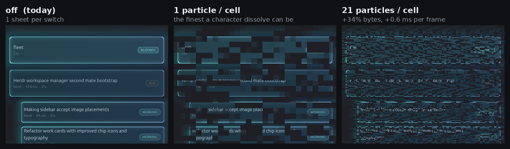
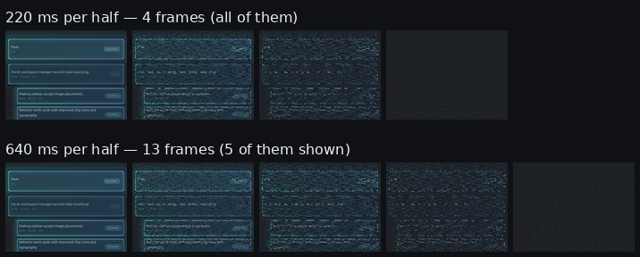

# What a denser sidebar dematerialize costs

Measured, not estimated. Re-derive any number here with:

```bash
cargo test --release --bin herdr dissolve_cost -- --ignored --nocapture
```

A **release** build. A debug build reports about six times the per-frame cost,
which is exactly the kind of gap a quoted figure hides.

## What was measured

The fixture is `image_card::tests::pixel_fleet_app` — the ten-card fleet at three
depths the card layout was calibrated against — in a 42x46-cell sidebar on a
10x21 px host cell. That produces a **41x37-cell sheet, 410x777 px**, and a
re-root onto `2ndmate-herdr` drives one real half-switch through the animation
engine's own clock at its 50 ms frame interval.

Each row is one whole half of a switch: the sheets actually produced, the PNG
bytes of each, and the wall clock inside `build_sheet` for each.

| `particles_per_cell` | delivered / cell | particle edge | sheets / half | PNG bytes / sheet | ms / sheet | KB / half |
| --- | --- | --- | --- | --- | --- | --- |
| 0 (off) | — | — | **1** | 170,393 | 17.7 | **166** |
| 1 | 1.1 | 14 px | 13 | 181,133 | 2.6 | 2,300 |
| 4 | 4.3 | 7 px | 13 | 198,310 | 2.7 | 2,518 |
| **20** | **23.3** | **3 px** | 13 | **243,455** | **3.2** | **3,091** |
| 64 | 52.5 | 2 px | 13 | 277,061 | 4.1 | 3,517 |
| 210 (per pixel) | 210 | 1 px | 13 | 352,671 | 6.3 | 4,477 |

`delivered / cell` is what the integer pixel edge actually yields, not what was
asked for. The count goes as the edge *squared*, so a 3 px edge on a 210 px cell
is 23 particles, not 20.

## The answer to "what would 20x cost"

Against one particle per cell — the finest a character-grid dissolve can be —
**21x the particles costs +34% PNG bytes per frame and +0.6 ms of CPU per frame.**

| | 1.1 / cell | 23.3 / cell | change |
| --- | --- | --- | --- |
| PNG bytes per sheet | 181,133 | 243,455 | **+34%** |
| ms per sheet | 2.61 | 3.21 | **+23%** |

This confirms the saturation finding from
`data/herdr-particle-background-tradeoff/`: particle count is the cheapest
fidelity in the system, and it transfers to herdr's shipped path because that
path is also a PNG. The sheet is `png::Compression::Fast` RGBA, base64'd into a
Kitty graphics transmission — the same compression regime the earlier renders
were measured in, which is why 21x lands at +34% and not +2000%.

## The cost that is not the particles

Density is not where the money goes. **Switching the effect on at all is.**

The card sheet is opaque over every cell a card occupies and is keyed on a
content signature. During a switch the rows have not moved yet — that is the
point of the switch — so today the sheet is rasterised **once** and the cards
stand perfectly still while the characters around them dissolve, then jump at
the commit instant. Making them dissolve means the sheet is re-encoded on every
frame:

| | today | 21 particles / cell |
| --- | --- | --- |
| sheets per switch | 1 | 26 |
| PNG bytes per switch | 166 KB | **6.0 MB** |
| on the wire after base64 | 222 KB | **8.0 MB** |

That is a **37x** increase, and every bit of it comes from the frame count, not
from the grain. Two things drive the frame count: the effect being on, and
`view_switch_ms`. Raising the duration from 220 ms to 640 ms takes a half from
4 frames to 13, so it roughly triples the wire cost on its own.

Fine on a local terminal. Worth thinking about over a slow link, which is why
the flag is off by default.

## Where the per-frame time goes, and the one optimisation taken

Before caching, a transition frame cost ~17.7 ms — a full re-rasterisation of
ten cards, their bloom and their type, to arrive at pixels identical to the ones
produced 50 ms earlier. The split:

| | ms |
| --- | --- |
| rasterise the cards | ~16 |
| encode the PNG | ~1.4 |
| apply the dissolve (3 px particles) | ~0.75 |

So the sheet now holds its own undissolved canvas for the length of one switch
and each frame clones it, masks alpha, and re-encodes. **17.7 ms → 2.6–3.2 ms.**
The canvas is ~1.3 MB and is held only while a switch is running.

## What it looks like

Mid-switch, same frame, three settings:



One particle per cell is the ceiling of the character path, and it reads as a
broken picture rather than as one coming apart — 14 px blocks are large enough
to look like corruption. At 21 per cell the cards fray.

The duration, at the same density:



220 ms is four frames per half. There is no amount of grain that makes four
frames read as motion.

Frames regenerate with:

```bash
HERDR_DISSOLVE_CAPTURE_DIR=/some/dir \
  cargo test --release --bin herdr dissolve_capture -- --ignored --nocapture
```
